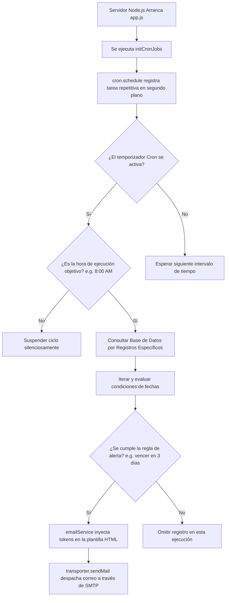

# Guía de Notificaciones por Correo Electrónico y Tareas Programadas (Cron) en Node.js

Esta guía documenta la implementación de un sistema genérico, modular y profesional para el envío de correos electrónicos enriquecidos (HTML y adjuntos) y la ejecución de tareas programadas en segundo plano. Puede ser adaptada y replicada en cualquier proyecto Node.js.

---

## 🛠️ 1. Dependencias Necesarias

Instala los módulos estándar requeridos para la solución en tu nuevo proyecto:

```bash
npm install nodemailer node-cron dotenv
```

*   **`nodemailer`**: Cliente SMTP de Node.js que procesa el envío de correos electrónicos en formato HTML con soporte para archivos adjuntos.
*   **`node-cron`**: Programador asíncrono basado en expresiones de tiempo Cron que corre tareas periódicas en segundo plano en el hilo de Node.
*   **`dotenv`**: Módulo para cargar de forma segura las credenciales de servidores de correos desde un archivo `.env`.

---

## 🔑 2. Variables de Entorno (`.env`)

Agrega a las variables de entorno de tu aplicación los parámetros de conexión SMTP de tu proveedor de correo (ej. SendGrid, Gmail, Mailgun, SMTP corporativo):

```env
# Configuración del servidor de correos (SMTP)
EMAIL_HOST=smtp.tuservidor.com
EMAIL_PORT=465
EMAIL_USER=notificaciones@tuapp.com
EMAIL_PASS=TuContrasenaDeAplicacionSegura
```

> [!TIP]  
> Para proveedores de correo con alta seguridad (como Gmail o Outlook), deberás activar la verificación de dos factores y generar una **Contraseña de aplicación** específica en la configuración de seguridad de tu cuenta.

---

## 📊 3. Modelo de Base de Datos para Plantillas Dinámicas (Opcional)

Si deseas permitir que los administradores modifiquen los textos y asuntos de los correos desde un panel de administración web sin tener que tocar código fuente ni desplegar de nuevo, crea la siguiente estructura en tu base de datos:

```sql
CREATE TABLE plantillas_correo (
    id INT AUTO_INCREMENT PRIMARY KEY,
    slug VARCHAR(50) UNIQUE NOT NULL,       -- Identificador único de la plantilla (ej. 'bienvenida_usuario')
    nombre VARCHAR(100) NOT NULL,            -- Nombre administrativo descriptivo
    asunto VARCHAR(255) NOT NULL,            -- Asunto del correo por defecto
    html_content TEXT NOT NULL,              -- Estructura HTML con marcadores de posición {{variable}}
    created_at TIMESTAMP DEFAULT CURRENT_TIMESTAMP
);
```

---

## ✉️ 4. Implementación del Servicio de Correo (`emailService.js`)

Este servicio encapsula el transporte SMTP de Nodemailer, cuenta con un motor básico de renderizado (reemplazo de marcadores de posición del tipo `{{variable}}`) y ofrece un mecanismo de *fallback* (plantilla HTML predeterminada escrita en código) en caso de que la plantilla en base de datos no se encuentre cargada.

Crea el archivo `utils/emailService.js`:

```javascript
const nodemailer = require('nodemailer');
require('dotenv').config();

// Inicializar transporte SMTP seguro
const transporter = nodemailer.createTransport({
    host: process.env.EMAIL_HOST,
    port: parseInt(process.env.EMAIL_PORT) || 465,
    secure: true, // true para puerto 465 (SSL/TLS), false para otros
    auth: {
        user: process.env.EMAIL_USER,
        pass: process.env.EMAIL_PASS
    }
});

/**
 * Función auxiliar para reemplazar tokens de variables dinámicas en el HTML.
 * Soporta espacios en blanco dentro de las llaves: {{ variable }} y {{variable}}.
 */
async function renderizar(slug, datos, fallbackHtml) {
    try {
        // EJEMPLO: Consulta a tu BD si implementaste plantillas editables
        // const plantilla = await tuModeloDeBaseDatos.obtenerPorSlug(slug);await db.query('SELECT * FROM plantillas_correo WHERE slug = ?', [slug]);
        const plantilla = null; // Reemplazar con datos reales de la BD si aplica

        let html = (plantilla && plantilla.html_content) ? plantilla.html_content : fallbackHtml;
        let asunto = (plantilla && plantilla.asunto) ? plantilla.asunto : null;

        // Reemplazar todas las llaves inyectadas
        Object.keys(datos).forEach(key => {
            const regex = new RegExp(`\\{\\{\\s*${key}\\s*\\}\\}`, 'g');
            html = html.replace(regex, () => datos[key]);
        });

        return { asunto, html };
    } catch (e) {
        console.error(`Error al procesar plantilla de correo '${slug}':`, e);
        return { asunto: null, html: fallbackHtml };
    }
}

const emailService = {
    /**
     * Envía un correo electrónico de forma asíncrona
     * @param {string} destinatario - Email del receptor.
     * @param {string} asunto - Asunto del correo.
     * @param {string} contenidoHTML - Cuerpo en HTML.
     * @param {Array} [adjuntos=[]] - Array opcional de archivos adjuntos.
     */
    enviarCorreo: async (destinatario, asunto, contenidoHTML, adjuntos = []) => {
        if (!destinatario) return;
        try {
            await transporter.sendMail({
                from: `"Notificaciones Automáticas" <${process.env.EMAIL_USER}>`,
                to: destinatario,
                subject: asunto,
                html: contenidoHTML,
                attachments: adjuntos // Ej. [{ filename: 'Factura.pdf', content: buffer }]
            });
            console.log(`[EMAIL] Correo enviado a ${destinatario} con ${adjuntos.length} adjunto(s).`);
        } catch (error) {
            console.error('[EMAIL] Error en envío de correo:', error.message);
        }
    },

    /**
     * Plantilla 1: Bienvenida al sistema (Ejemplo Genérico)
     */
    plantillaBienvenida: async (nombreUsuario, emailUsuario) => {
        const fallback = `
            <div style="background-color: #f8fafc; padding: 30px; font-family: Arial, sans-serif;">
                <table align="center" width="100%" style="max-width: 600px; background: #ffffff; border-radius: 12px; overflow: hidden; border: 1px solid #e2e8f0; box-shadow: 0 4px 6px -1px rgba(0,0,0,0.05);">
                    <tr style="background-color: #4f46e5; color: #ffffff;"><td align="center" style="padding: 30px;"><h2>🚀 ¡Te damos la bienvenida!</h2></td></tr>
                    <tr><td style="padding: 30px; color: #334155; font-size: 16px; line-height: 1.6;">
                        <p>Hola <strong>${nombreUsuario}</strong>,</p>
                        <p>Tu cuenta ha sido creada exitosamente. Ya puedes ingresar al portal usando tu correo registrado: <strong>${emailUsuario}</strong>.</p>
                        <p align="center" style="margin: 30px 0;"><a href="https://tuapp.com/login" style="background-color: #4f46e5; color: #ffffff; padding: 12px 25px; border-radius: 6px; text-decoration: none; font-weight: bold; display: inline-block;">Acceder a Mi Cuenta</a></p>
                    </td></tr>
                </table>
            </div>
        `;
        const datos = { usuario: nombreUsuario, email: emailUsuario };
        const res = await renderizar('bienvenida_usuario', datos, fallback);
        return {
            asunto: res.asunto || `¡Bienvenido a nuestra plataforma, ${nombreUsuario}!`,
            html: res.html
        };
    },

    /**
     * Plantilla 2: Alerta de Expiración / Recordatorio de Evento (Ejemplo Genérico)
     */
    plantillaAlertaExpiracion: async (nombreUsuario, servicioNombre, diasRestantes) => {
        const fallback = `
            <div style="background-color: #fffbeb; padding: 30px; font-family: Arial, sans-serif;">
                <table align="center" width="100%" style="max-width: 600px; background: #ffffff; border-radius: 12px; overflow: hidden; border: 1px solid #fef3c7;">
                    <tr style="background-color: #d97706; color: #ffffff;"><td align="center" style="padding: 30px;"><h2>⚠️ Alerta de Vencimiento</h2></td></tr>
                    <tr><td style="padding: 30px; color: #334155; font-size: 16px; line-height: 1.6;">
                        <p>Hola <strong>${nombreUsuario}</strong>,</p>
                        <p>Te informamos que tu suscripción al servicio <strong>${servicioNombre}</strong> vencerá en <strong>${diasRestantes} días</strong>.</p>
                        <div style="background-color: #fffbeb; border-left: 4px solid #d97706; padding: 15px; border-radius: 4px; margin: 20px 0; font-size: 18px; font-weight: bold; color: #b45309;">
                            Plazo restante: ${diasRestantes} días.
                        </div>
                        <p>Para evitar interrupciones, renueva tu plan antes del vencimiento.</p>
                    </td></tr>
                </table>
            </div>
        `;
        const datos = { usuario: nombreUsuario, servicio: servicioNombre, dias: diasRestantes };
        const res = await renderizar('alerta_expiracion', datos, fallback);
        return {
            asunto: res.asunto || `Acción Requerida: Tu suscripción a ${servicioNombre} vence pronto`,
            html: res.html
        };
    }
};

module.exports = emailService;
```

---

## ⏰ 5. Tareas Programadas en Segundo Plano (`jobs.js`)

El programador de tareas (`node-cron`) corre en segundo plano y puede configurarse para ejecutarse con frecuencias específicas (diaria, horaria, minutuaria). 

En el siguiente ejemplo, el Cron Job corre a cada hora. Sin embargo, para evitar saturar el servidor y enviar correos de madrugada a los usuarios, se incorpora una restricción lógica que evalúa si es la hora ideal de ejecución diaria (por ejemplo, a las **8:00 AM**). Si no es esa hora, la tarea se suspende silenciosamente.

Crea el archivo `cron/jobs.js`:

```javascript
const cron = require('node-cron');
const emailService = require('../utils/emailService');

// EJEMPLO: Importación de tus consultas a base de datos
// const db = require('../config/db');

function initCronJobs() {
    /**
     * Cron Job: Corre cada hora al minuto 0 ('0 * * * *')
     * Puedes ajustar la expresión según tu necesidad:
     * - '0 0 * * *' para correr una vez al día a la medianoche.
     * - '*/30 * * * *' para correr cada 30 minutos.
     */
    cron.schedule('0 * * * *', async () => {
        try {
            const currentHour = new Date().getHours();
            const targetHour = 8; // Restringir envío a las 8:00 AM

            if (currentHour !== targetHour) {
                return; // Ignorar si no es la hora de alertas diaria configurada
            }

            console.log(`[CRON] Iniciando verificación diaria de suscripciones a las ${currentHour}:00...`);

            // 1. Obtener registros desde tu base de datos
            // Supongamos que buscamos usuarios con suscripciones próximas a expirar en 3 días.
            // Ejemplo de consulta SQL ficticia:
            // const [usuarios] = await db.query(
            //     "SELECT nombre, email, servicio, DATEDIFF(fecha_vencimiento, CURDATE()) as dias FROM suscripciones WHERE estado = 'activo'"
            // );
            
            // Mock de datos de ejemplo
            const usuariosMock = [
                { nombre: 'Carlos Gómez', email: 'carlos@ejemplo.com', servicio: 'Hosting Premium', dias: 3 },
                { nombre: 'Ana Suárez', email: 'ana@ejemplo.com', servicio: 'Suscripción SaaS', dias: 7 }
            ];

            for (const usuario of usuariosMock) {
                // Si el vencimiento es en exactamente 3 días
                if (usuario.dias === 3) {
                    // Generar estructura HTML del correo
                    const { asunto, html } = await emailService.plantillaAlertaExpiracion(
                        usuario.nombre,
                        usuario.servicio,
                        usuario.dias
                    );

                    // Enviar correo
                    await emailService.enviarCorreo(usuario.email, asunto, html);
                    console.log(`[CRON] Notificación de expiración enviada a: ${usuario.email}`);
                }
            }

            console.log('[CRON] Verificación de expiraciones diaria completada.');

        } catch (error) {
            console.error('[CRON] Error al ejecutar tarea programada:', error);
        }
    });
}

module.exports = { initCronJobs };
```

---

## 🎬 6. Puesta en Marcha (`app.js`)

Para arrancar el planificador en segundo plano cuando se inicia el servidor de Node.js / Express, importa e invoca la función de inicialización del Cron en tu archivo principal de entrada:

```javascript
const express = require('express');
const app = express();
const { initCronJobs } = require('./cron/jobs');

// Iniciar procesos programados en segundo plano
initCronJobs();

// Configuración adicional del servidor Express...
const PORT = process.env.PORT || 3000;
app.listen(PORT, () => {
    console.log(`[SERVER] Servidor web iniciado en puerto ${PORT}`);
});
```

---

## 📋 7. Flujo de Control


