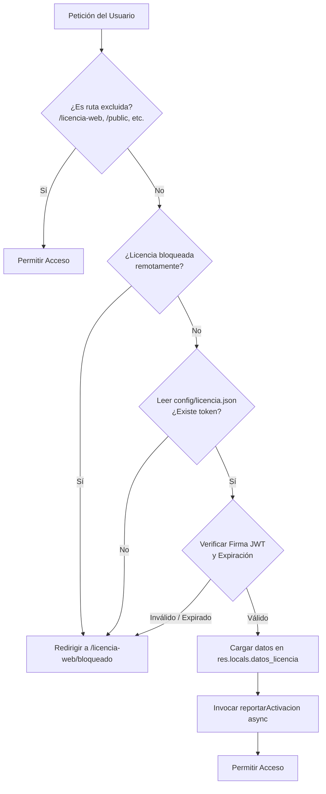

# Guía Técnica: Replicación e Implementación del Sistema de Licencias

Esta guía proporciona la documentación detallada y el paso a paso para replicar e integrar el sistema de licenciamiento profesional (offline/online) en un nuevo proyecto. Este sistema permite verificar la validez de la aplicación de forma local mediante criptografía asimétrica/simétrica y revalidar el estado de manera remota con un panel administrador de licencias, garantizando resiliencia y funcionamiento autónomo (offline).

---

## 1. Arquitectura del Sistema de Licencias

El sistema de licenciamiento se basa en dos pilares fundamentales:

1. **Validación Local (Offline):** La aplicación lee un archivo local (`config/licencia.json`) que almacena un **JSON Web Token (JWT)**. Este token contiene los datos de la empresa y la fecha de expiración, firmado con una clave secreta (`JWT_SECRET`). El middleware del sistema valida criptográficamente la integridad y expiración del token en cada petición sin necesidad de conectarse a internet.
2. **Validación Remota (Online):** De manera asíncrona y según un intervalo definido (por defecto 1 hora), el sistema envía una petición HTTP POST al panel central de licencias (`PANEL_LICENCIAS_URL`). Si el panel responde que la licencia está suspendida o cancelada (códigos de estado `401`, `403` o `423`), el sistema se bloquea. Si el panel está fuera de línea (offline), la aplicación continúa funcionando normalmente, priorizando la disponibilidad del servicio.



---

## 2. Variables de Entorno (`.env`)

Para que el sistema de licenciamiento funcione, se deben configurar las siguientes variables de entorno en el archivo `.env`:

```env
# URL del panel central donde se gestionan y venden las licencias
PANEL_LICENCIAS_URL=http://localhost:4000

# Frecuencia con la que el sistema consulta al panel remoto (1 hora = 3600000 ms)
LICENCIA_INTERVALO_MS=3600000
```

*Nota: Se recomienda parametrizar también la firma secreta de los tokens (p. ej., `JWT_SECRET_LICENCIA`) para evitar dejarla hardcodeada en el código fuente.*

---

## 3. Estructura de Archivos del Sistema

Para replicar este sistema en un nuevo proyecto, se deben copiar o crear los siguientes archivos:

*   **`config/licencia.json`**: Almacena el token de licencia actual.
*   **`middleware/licencias.js`**: Intercepta las solicitudes y valida la licencia local y remota.
*   **`routes/licencia-web.js`**: Controla el flujo de bloqueo y activación manual.
*   **`routes/mi-licencia.js`**: Rutas para la visualización del estado y renovación dentro de la administración.
*   **`views/licencia-bloqueada.ejs`**: Interfaz de bloqueo del sistema.
*   **`views/mi-licencia.ejs`**: Interfaz de control y actualización de licencia.

---

## 4. Implementación Paso a Paso

### Paso 1: Dependencias del Proyecto
Asegúrese de tener instalados los siguientes paquetes en el archivo `package.json`:

```bash
npm install jsonwebtoken express
```

### Paso 2: Crear el Archivo de Licencia Inicial
Cree el directorio `config` en la raíz de su proyecto y agregue un archivo `licencia.json` vacío o con el siguiente contenido por defecto:

```json
{
  "token": ""
}
```

### Paso 3: Middleware de Validación (`middleware/licencias.js`)
Este archivo contiene la lógica de verificación local del JWT y la llamada asíncrona en segundo plano al servidor de licencias.

```javascript
const jwt = require('jsonwebtoken');
const fs = require('fs');
const path = require('path');
const https = require('https');
const http = require('http');

// Clave secreta para desencriptar el JWT (Debe coincidir con la del panel generador)
const JWT_SECRET = process.env.JWT_SECRET_LICENCIA || 'Kj$8LmpP@qZ1xV#9RtW&3Nf*cYuTbE^2oSvA!';
const JSON_PATH = path.join(__dirname, '../config/licencia.json');

const PANEL_URL = process.env.PANEL_LICENCIAS_URL || 'http://localhost:4000';
const INTERVALO = parseInt(process.env.LICENCIA_INTERVALO_MS) || 3600000;

let ultimaVerificacionMs = 0;
let estadoLicenciaRemota = 'ok'; // 'ok' o 'bloqueado'

/**
 * Reporta de forma asíncrona la activación de la licencia al panel de control.
 * @param {string} token - Token JWT de la licencia.
 */
function reportarActivacion(token) {
    const ahora = Date.now();
    
    // Evitar saturar el servidor remoto si ya se validó dentro del intervalo establecido
    if (ahora - ultimaVerificacionMs < INTERVALO && estadoLicenciaRemota === 'ok') return;

    ultimaVerificacionMs = ahora;

    try {
        const body = JSON.stringify({ token, servidor: require('os').hostname() });

        const urlObj = new URL(`${PANEL_URL}/api/activacion`);
        const lib = urlObj.protocol === 'https:' ? https : http;

        const options = {
            hostname: urlObj.hostname,
            port: urlObj.port || (urlObj.protocol === 'https:' ? 443 : 80),
            path: urlObj.pathname,
            method: 'POST',
            headers: { 
                'Content-Type': 'application/json', 
                'Content-Length': Buffer.byteLength(body) 
            },
            timeout: 5000,
            rejectUnauthorized: false // Ignorar advertencias de certificados auto-firmados
        };

        const req = lib.request(options, (res) => {
            console.log(`[Licencia] Código de respuesta remota: ${res.statusCode}`);

            // Bloquear si el panel explícitamente revoca la autorización
            if (res.statusCode === 403 || res.statusCode === 401 || res.statusCode === 423) {
                console.warn('[Licencia] ATENCIÓN: El panel central ha desactivado esta licencia.');
                estadoLicenciaRemota = 'bloqueado';
            } else if (res.statusCode === 200) {
                estadoLicenciaRemota = 'ok';
            }
        });

        req.on('error', (e) => {
            console.error(`[Licencia] Error de conexión remota: ${e.message}`);
            console.log('[Licencia] Panel inaccesible. Operando en Modo Offline Resiliente.');
        });

        req.on('timeout', () => {
            req.destroy();
        });

        req.write(body);
        req.end();
    } catch (e) {
        // Fallback para evitar que un error de red tumbe el sistema
    }
}

/**
 * Middleware para validar la licencia en cada solicitud entrante.
 */
const verificarLicencia = (req, res, next) => {
    const url = req.originalUrl;

    // Rutas del sistema excluidas de validación para evitar bloqueos infinitos
    if (url.startsWith('/licencia-web') || url.startsWith('/public') || url.startsWith('/css') || url.startsWith('/js') || url.startsWith('/uploads')) {
        return next();
    }

    // Si la licencia fue marcada como bloqueada remotamente
    if (estadoLicenciaRemota === 'bloqueado') {
        req.flash('error_licencia', 'SU LICENCIA HA SIDO SUSPENDIDA O PAUSADA');
        return res.redirect('/licencia-web/bloqueado');
    }

    try {
        if (!fs.existsSync(JSON_PATH)) {
            fs.writeFileSync(JSON_PATH, JSON.stringify({ token: "" }), 'utf-8');
        }

        const fileData = fs.readFileSync(JSON_PATH, 'utf-8');
        const config = JSON.parse(fileData);

        if (!config.token || config.token.trim() === '') {
            return res.redirect('/licencia-web/bloqueado');
        }

        // Validación criptográfica y temporal del JWT
        jwt.verify(config.token, JWT_SECRET, (err, decoded) => {
            if (err) {
                const mensaje = err.name === 'TokenExpiredError'
                    ? 'SU LICENCIA HA EXPIRADO'
                    : 'LICENCIA INVÁLIDA O CORRUPTA';

                req.flash('error_licencia', mensaje);
                return res.redirect('/licencia-web/bloqueado');
            }

            // Reporte en segundo plano
            reportarActivacion(config.token);

            // Inyectar datos de la licencia en la solicitud para uso posterior
            res.locals.datos_licencia = decoded;
            next();
        });
    } catch (error) {
        console.error('[Licencia] Error crítico de validación:', error);
        res.redirect('/licencia-web/bloqueado');
    }
};

module.exports = {
    verificarLicencia,
    forzarRevalidacion: () => {
        estadoLicenciaRemota = 'ok';
        ultimaVerificacionMs = 0;
    }
};
```

### Paso 4: Integración del Middleware (`app.js` / `server.js`)
Registre el middleware y sus rutas en el punto de entrada principal de su aplicación Express.

```javascript
const express = require('express');
const app = express();

// Inyección del validador de licencias antes de las rutas de negocio
const { verificarLicencia } = require('./middleware/licencias');
app.use(verificarLicencia);

// Registro de las rutas de licencia
app.use('/licencia-web', require('./routes/licencia-web'));
app.use('/mi-licencia', require('./routes/mi-licencia'));
```

### Paso 5: Rutas Públicas de Activación (`routes/licencia-web.js`)
Este enrutador maneja la redirección de los usuarios bloqueados y la carga inicial del token cuando el sistema no está activado.

```javascript
const express = require('express');
const router = express.Router();
const fs = require('fs');
const path = require('path');
const jwt = require('jsonwebtoken');

const JSON_PATH = path.join(__dirname, '../config/licencia.json');
const JWT_SECRET = process.env.JWT_SECRET_LICENCIA || 'Kj$8LmpP@qZ1xV#9RtW&3Nf*cYuTbE^2oSvA!';
const { forzarRevalidacion } = require('../middleware/licencias');

// Vista de bloqueo
router.get('/bloqueado', (req, res) => {
    const mensaje = req.flash('error_licencia');
    res.render('licencia-bloqueada', { 
        error_licencia: mensaje.length > 0 ? mensaje[0] : 'SU LICENCIA REQUIERE ATENCIÓN' 
    });
});

// Revalidar licencia actual contra el panel
router.get('/revalidar-actual', (req, res) => {
    forzarRevalidacion();
    res.redirect('/');
});

// Validar y guardar nueva licencia ingresada por formulario
router.post('/validar-token', (req, res) => {
    const nuevoToken = (req.body.token_licencia || '').trim();

    if (!nuevoToken) {
        req.flash('error_licencia', 'El token de activación está vacío.');
        return res.redirect('/licencia-web/bloqueado');
    }

    jwt.verify(nuevoToken, JWT_SECRET, (err, decoded) => {
        if (err) {
            req.flash('error_licencia', 'TOKEN DE LICENCIA INVÁLIDO O CADUCADO');
            return res.redirect('/licencia-web/bloqueado');
        }

        try {
            fs.writeFileSync(JSON_PATH, JSON.stringify({ token: nuevoToken }), 'utf-8');
            forzarRevalidacion(); // Resetear flags para consultar de inmediato
            res.redirect('/');
        } catch(e) {
            req.flash('error_licencia', 'Error físico al guardar licencia en el servidor.');
            res.redirect('/licencia-web/bloqueado');
        }
    });
});

module.exports = router;
```

### Paso 6: Panel Administrativo de la Licencia (`routes/mi-licencia.js`)
Permite ver los metadatos de la licencia y actualizarla sin salir del panel de administración del sistema.

```javascript
const express = require('express');
const router = express.Router();
const fs = require('fs');
const path = require('path');
const jwt = require('jsonwebtoken');

const JSON_PATH = path.join(__dirname, '../config/licencia.json');
const JWT_SECRET = process.env.JWT_SECRET_LICENCIA || 'Kj$8LmpP@qZ1xV#9RtW&3Nf*cYuTbE^2oSvA!';

function isLoggedIn(req, res, next) {
    if (req.session && req.session.usuario) return next();
    res.redirect('/auth/login');
}

router.get('/', isLoggedIn, (req, res) => {
    let licenciaInfo = {
        estado: 'Sin Licencia',
        estadoClase: 'bloqueada',
        diasRestantes: 0,
        fechaVencimiento: null,
        fechaEmision: null,
        ruc: 'N/A',
        empresaId: 'N/A',
        tipo: 'N/A',
        tokenActual: '',
        porcentajeVigencia: 0
    };

    try {
        if (fs.existsSync(JSON_PATH)) {
            const fileData = fs.readFileSync(JSON_PATH, 'utf-8');
            const config = JSON.parse(fileData);

            if (config.token) {
                // Se decodifica sin validar firma para mostrar info vencida/inválida
                const decoded = jwt.decode(config.token);

                if (decoded) {
                    licenciaInfo.ruc = decoded.ruc || 'N/A';
                    licenciaInfo.empresaId = decoded.empresa_id || 'N/A';
                    licenciaInfo.tipo = decoded.tipo || 'N/A';
                    licenciaInfo.tokenActual = config.token;

                    if (decoded.iat) {
                        licenciaInfo.fechaEmision = new Date(decoded.iat * 1000).toLocaleDateString('es-CO');
                    }

                    if (decoded.exp) {
                        const ahora = new Date();
                        const vence = new Date(decoded.exp * 1000);
                        const emitido = new Date(decoded.iat * 1000);

                        licenciaInfo.fechaVencimiento = vence.toLocaleDateString('es-CO');

                        const msRestantes = vence - ahora;
                        licenciaInfo.diasRestantes = Math.max(0, Math.ceil(msRestantes / (1000 * 60 * 60 * 24)));

                        const totalDias = Math.ceil((vence - emitido) / (1000 * 60 * 60 * 24));
                        licenciaInfo.porcentajeVigencia = totalDias > 0
                            ? Math.min(100, Math.round((licenciaInfo.diasRestantes / totalDias) * 100))
                            : 0;

                        if (msRestantes <= 0) {
                            licenciaInfo.estado = 'Expirada';
                            licenciaInfo.estadoClase = 'expirada';
                        } else if (licenciaInfo.diasRestantes <= 7) {
                            licenciaInfo.estado = 'Por Vencer';
                            licenciaInfo.estadoClase = 'por-vencer';
                        } else {
                            licenciaInfo.estado = 'Activa';
                            licenciaInfo.estadoClase = 'activa';
                        }
                    } else {
                        licenciaInfo.estado = 'Activa';
                        licenciaInfo.estadoClase = 'activa';
                        licenciaInfo.fechaVencimiento = 'Perpetua';
                        licenciaInfo.diasRestantes = '∞';
                        licenciaInfo.porcentajeVigencia = 100;
                    }
                }
            }
        }
    } catch (e) {
        console.error('[Licencia] Error leyendo archivo de configuración:', e.message);
    }

    res.render('mi-licencia', { licenciaInfo, usuario: req.session.usuario });
});

// Endpoint para actualizar la licencia desde el panel administrativo
router.post('/renovar', isLoggedIn, (req, res) => {
    const nuevoToken = (req.body.token_licencia || '').trim();

    if (!nuevoToken) {
        req.flash('mensajeError', 'El token no puede estar vacío.');
        return res.redirect('/mi-licencia');
    }

    jwt.verify(nuevoToken, JWT_SECRET, (err, decoded) => {
        if (err) {
            const msg = err.name === 'TokenExpiredError'
                ? 'El token provisto ya ha expirado.'
                : 'Token corrupto o firma inválida.';
            req.flash('mensajeError', msg);
            return res.redirect('/mi-licencia');
        }

        try {
            fs.writeFileSync(JSON_PATH, JSON.stringify({ token: nuevoToken }), 'utf-8');
            req.flash('mensajeExito', '✅ Licencia actualizada correctamente.');
            res.redirect('/mi-licencia');
        } catch (e) {
            req.flash('mensajeError', 'Error de escritura de licencia en disco.');
            res.redirect('/mi-licencia');
        }
    });
});

module.exports = router;
```

---

## 5. Estructura del JWT Generado

El Panel de Licencias de venta debe generar un token JWT firmado con el algoritmo HS256 utilizando la firma secreta compartida (`JWT_SECRET`). El payload del JWT debe estructurarse con la siguiente metadata de negocio:

### Formato del Payload (JSON)
```json
{
  "empresa_id": 105,
  "ruc": "800234567-9",
  "cliente": "Empresa de Créditos S.A.",
  "tipo": "Premium",
  "iat": 1780000000,
  "exp": 1811558400
}
```

### Campos Clave:
*   `empresa_id` (Integer): Identificador único del cliente registrado.
*   `ruc` / `nit` (String): Documento de identidad fiscal de la empresa asociada.
*   `cliente` (String): Nombre del licenciatario para mostrar en cabeceras o logs.
*   `tipo` (String): Versión del sistema contratado (e.g. Básica, Profesional, Premium).
*   `iat` (Unix Timestamp): Fecha y hora en la que se emitió el token (generada automáticamente por el firmador JWT).
*   `exp` (Unix Timestamp): Fecha y hora en la que expira el token. Si no se incluye este campo, el sistema lo interpretará automáticamente como una **licencia perpetua/ilimitada**.

---

## 6. Respuestas Esperadas del Panel Central de Licencias

Para validar activaciones de forma remota, el panel debe exponer la ruta `POST /api/activacion`. El cuerpo de la solicitud enviado por el sistema contiene:

```json
{
  "token": "JWT_TOKEN_COMPLETO",
  "servidor": "HOST_DE_EJECUCION"
}
```

El panel de control debe responder con los siguientes códigos de estado según el estado comercial de la licencia:

*   `200 OK`: Licencia activa y válida en la base de datos comercial.
*   `401 Unauthorized` / `403 Forbidden`: Licencia desactivada manualmente (p. ej., por falta de pago del canon recurrente o fraude).
*   `423 Locked`: Licencia bloqueada temporalmente o suspendida por auditoría.

---

## 7. Instrucciones para la Simulación y Pruebas

Para garantizar que el sistema funciona bajo todos los escenarios de validación antes de pasarlo a producción, realice las siguientes pruebas locales:

1.  **Caso Sin Licencia (Primer Inicio):**
    *   Borre el token dentro de `config/licencia.json` (`{ "token": "" }`).
    *   Inicie la aplicación e intente ingresar a la raíz `/`.
    *   *Resultado esperado:* Debe ser redirigido inmediatamente a la vista de bloqueo `/licencia-web/bloqueado` con el mensaje informativo de contacto de proveedor.
2.  **Caso Licencia Expirada:**
    *   Genere un JWT con una fecha de expiración (`exp`) en el pasado (p. ej., ayer) usando herramientas como `jwt.io` con la firma secreta.
    *   Copie el token en `config/licencia.json`.
    *   *Resultado esperado:* Debe aparecer el mensaje "SU LICENCIA HA EXPIRADO" en la pantalla de bloqueo.
3.  **Caso Bloqueo Remoto (Online):**
    *   Configure `PANEL_LICENCIAS_URL` apuntando a un servidor mock o endpoint local.
    *   Haga que ese endpoint devuelva un código HTTP `403` al recibir la petición de verificación.
    *   *Resultado esperado:* En el momento en que se ejecute la validación remota, el sistema marcará el estado interno como `bloqueado` y el usuario será expulsado hacia la vista de bloqueo.
4.  **Caso Resiliencia (Offline):**
    *   Configure un `PANEL_LICENCIAS_URL` falso o caiga intencionalmente el servidor mock de licencias.
    *   *Resultado esperado:* La consola imprimirá el error de conexión (`ECONNREFUSED` u offline), pero la aplicación local continuará permitiendo la navegación del cliente sin interrupciones siempre que el token local esté en regla.
